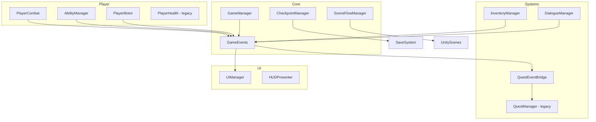

# 5-Room Dungeon Crawler — Architecture

## Overview

This project implements a **modular 3D dungeon crawler** in Unity (C#) using a **manager + system** pattern. Gameplay flows through five dungeon rooms aligned with the classic **5-Room Dungeon** design pattern. New code lives under `Assets/_DungeonCrawler/` and **bridges** to existing systems in `Assets/Scripts/` (quests, inventory, save, audio).

---

## Folder Hierarchy

```
Assets/
├── _DungeonCrawler/
│   ├── Documentation/          ← ARCHITECTURE.md, SETUP_GUIDE.md
│   ├── ScriptableObjects/      ← Dialogue, Items, Abilities, Boss data
│   ├── Prefabs/                ← Player rig, enemies, pickups, UI (assign in editor)
│   └── Scripts/
│       ├── Core/               ← GameManager, GameEvents, SceneFlow, Checkpoints
│       ├── Abilities/          ← Dash, Jump, Projectile + AbilityManager
│       ├── Inventory/          ← InventoryManager, pickups, item SOs
│       ├── Dialogue/           ← DialogueManager, NPC interactables
│       ├── Quests/             ← Quest bridges, room triggers, sequential chains
│       ├── Combat/             ← Health, damage, projectiles, weapons
│       ├── Boss/               ← Boss phases, spawner
│       ├── World/              ← Room triggers, hazards, parkour reset
│       ├── UI/                 ← HUD, menus, victory, prompts
│       └── Player/             ← Enhanced movement, combat facade
├── Scripts/                    ← Legacy: QuestManager, PlayerHealth, cameras
├── ScriptableObjects/          ← Legacy: PlayerInventory, SaveSystem, ItemDatabase
└── Audio/                      ← AudioManager (mixer, SFX, music)
```

---

## System Diagram



---

## The Four Major Systems

### 1. Inventory System

| Script | Responsibility |
|--------|----------------|
| `ItemDataSO` | ScriptableObject: ID, name, icon, type (Weapon/Quest/Consumable) |
| `InventoryManager` | Singleton: add/remove items, equip weapon, fires `GameEvents` |
| `ItemPickup` | World pickup → adds to inventory, optional quest trigger |
| `InventoryUIView` | Refreshes grid from `InventoryManager` (wraps legacy `InventoryUI`) |

**Flow:** Player enters trigger → `ItemPickup` → `InventoryManager.AddItem()` → `GameEvents.OnItemCollected` → Quest bridge updates kill/collect objectives → HUD/Inventory UI refresh.

**Legacy bridge:** Also syncs `WeaponData` into `PlayerInventory.instance` for save compatibility.

---

### 2. Quest System

| Script | Responsibility |
|--------|----------------|
| `QuestManager` (legacy) | Holds all `QuestDataSO`, tracks progress, save/load |
| `QuestEventBridge` | Subscribes to `GameEvents`, calls `AddProgress(ObjectiveType, amount)` |
| `QuestObjectiveTrigger` | Collider/trigger fires custom quest ID progress |
| `SequentialQuestController` | Activates next quest in chain when previous completes |
| `RoomQuestBinder` | Binds dungeon room enum → quest IDs for tutorial flow |

**Flow:** Tutorial NPC dialogue → `GameEvents.OnDialogueEnded` → bridge adds Dialogue progress → Quest UI updates via `OnQuestUpdated`.

---

### 3. Dialogue System

| Script | Responsibility |
|--------|----------------|
| `DialogueDataSO` | Nodes, lines, branching choices, hints |
| `DialogueManager` | Plays conversations, handles choices, gates input |
| `NPCInteractable` | Press E → starts assigned dialogue |
| `DoorPuzzleGuard` | Validates collected hint item + correct choice index |

**Flow:** Interact → UI shows lines → player picks choice → `OnDialogueChoice` → door opens OR quest updates.

---

### 4. Ability System

| Script | Responsibility |
|--------|----------------|
| `AbilityDataSO` | Cooldown, key binding hint, icon |
| `AbilityBase` | Abstract cooldown + Execute |
| `DashAbility`, `JumpAbility`, `ProjectileShootAbility` | Concrete abilities |
| `AbilityManager` | Registers abilities, input routing, cooldown events |
| `AbilityCooldownHUD` | Subscribes to cooldown events for UI fill bars |

**Flow:** Room 3 (Parkour) requires Dash + Jump; Room 4 boss uses Projectile + melee from `PlayerCombat`.

---

## Managers Reference

| Manager | Role |
|---------|------|
| **GameManager** | Bootstrap, pause state, game over/victory, wires subsystems |
| **SceneFlowManager** | Main menu ↔ dungeon scene, async load optional |
| **CheckpointManager** | Saves position + room index at checkpoints |
| **UIManager** | Shows/hides menu layers, cursor lock |
| **DialogueManager** | Exclusive UI mode during conversation |
| **AbilityManager** | Player ability input + cooldowns |
| **InventoryManager** | Items + equipped weapon |
| **QuestManager** (legacy) | Quest database + persistence |
| **AudioManager** (legacy) | Mixer volumes, PlaySFX/PlayMusic |
| **QuestEventBridge** | Decouples gameplay from quest singleton |

---

## 5-Room Structure & Gameplay Flow

| Room | Design Role | Key Scripts |
|------|-------------|-------------|
| **1 — Entrance / Guardian** | Tutorial, story NPC, control prompts | `NPCInteractable`, `ControlPromptUI`, `CheckpointManager`, `SequentialQuestController` |
| **2 — Puzzle / RP** | Multi-NPC dialogue, combat for key, door quiz | `DialogueManager`, `DoorPuzzleGuard`, `ItemPickup`, `QuestObjectiveTrigger` |
| **3 — Trick / Parkour** | Dash, Jump, traps, camera | `PlayerMotor`, `DashAbility`, `ParkourResetZone`, `HazardDamage` |
| **4 — Climax** | Boss + adds | `BossController`, `EnemySpawner`, `PlayerCombat`, VFX hooks |
| **5 — Reward** | Victory UI, stats | `VictoryScreenUI`, `GameManager.TriggerVictory()` |

### Player Flow (Defense Demo)

```
Main Menu → Load Dungeon
  → Room 1: Talk to Guide NPC (movement/combat tutorial quests)
  → Checkpoint save
  → Room 2: Talk to hint NPCs → kill enemies for key → talk to guard → correct dialogue choice
  → Room 3: Parkour (Dash + Jump), fail = reset zone
  → Room 4: Boss fight (patterns, spawns, health bars)
  → Room 5: Victory screen (quests completed, items collected) → Credits or Restart
```

---

## Gameplay Loop

1. **Explore** room → triggers update quests  
2. **Interact** (dialogue, pickups) → inventory/quest/dialogue systems  
3. **Combat** → damage → loot/quest kill progress  
4. **Ability gating** → room geometry forces Dash/Jump  
5. **Checkpoint** → persist progress  
6. **Boss** → win → victory UI  

Repeat until all main quests complete.

---

## Scene Management

- **MainMenu** scene: `MainMenuController` + `SceneFlowManager.LoadDungeon()`  
- **Dungeon** scene (single scene, 5 zones): use empty GameObjects with `DungeonRoomController` + `RoomTrigger` colliders  
- **Optional:** additive loading per room — `SceneFlowManager` supports `LoadRoom(int index)` for scaling  

`GameManager` uses `DontDestroyOnLoad` for audio/quest/inventory singletons already marked persistent.

---

## How Scripts Communicate

**Prefer `GameEvents` (static C# events)** over direct references between unrelated systems.

Example chain — enemy killed:

```
EnemyHealth.Die → HealthComponent.OnDeath
  → GameEvents.RaiseEnemyKilled(enemyId)
  → QuestEventBridge → QuestManager.AddProgress(Kill, 1)
  → UIManager / QuestUIManager refresh
```

Example — equip weapon:

```
InventoryManager.EquipWeapon(id)
  → GameEvents.RaiseWeaponEquipped(weapon)
  → PlayerCombat applies damage/ranged mode
  → HUD shows weapon icon
```

---

## UI ↔ Gameplay Connection

| UI Panel | Data Source | Events |
|----------|-------------|--------|
| Health bar | `PlayerHealth` / `HealthComponent` | `OnPlayerDamaged` |
| Quest tracker | `QuestManager.OnQuestUpdated` | Bridge + legacy `QuestUIManager` |
| Inventory | `InventoryManager.OnInventoryChanged` | Tab key via `UIManager` |
| Dialogue | `DialogueManager` current node | Pauses player via `GameManager.SetGameplayPaused` |
| Ability cooldowns | `AbilityManager.OnCooldownChanged` | Per-ability fill images |
| Victory | `GameManager` victory payload | Quest list + inventory snapshot |

---

## Abilities × Inventory × Quests

- **Quest** "Collect Ancient Key" → requires `ItemPickup` with matching `itemId` → `InventoryManager.HasItem()`  
- **Quest** "Use Dash across gap" → `ParkourCheckpoint` trigger fires `Exploration` objective when `DashAbility` used in zone  
- **Dialogue** choice grants item → `DialogueDataSO` outcome → `InventoryManager.AddItem`  
- **Boss room** quest → `Kill` objective tied to boss `enemyId`  

---

## ScriptableObjects Checklist

| Asset | Menu Path |
|-------|-----------|
| Quest | `Quests/Quest Data` (existing) |
| Weapon | `Weapons/Weapon Data` (existing) |
| Item | `Dungeon/Item Data` |
| Dialogue | `Dungeon/Dialogue Data` |
| Ability | `Dungeon/Ability Data` |
| Boss | `Dungeon/Boss Data` |

---

## Implementation Order (Step-by-Step)

1. Import/create **Dungeon** scene with 5 zone empties + lighting/post-processing volume  
2. Place **GameManager** prefab (Core scripts + EventSystem)  
3. Configure **Player** with `CharacterController`, `PlayerMotor`, `AbilityManager`, `PlayerCombat`, legacy `PlayerHealth`  
4. Assign **ThirdPersonCameraController** + camera pivot on player  
5. Create **ScriptableObjects** for tutorial quest chain + dialogue trees  
6. Wire **QuestManager** quest list + `QuestEventBridge` on same GameObject  
7. Build **UI Canvas** (HUD, pause, dialogue, inventory, victory) → `UIManager` references  
8. Place **Room 1** NPC + `ControlPromptUI` triggers  
9. **Room 2** NPCs + `DoorPuzzleGuard` + enemy prefabs with `HealthComponent`  
10. **Room 3** platforms + `ParkourResetZone` + enable Dash/Jump in `AbilityManager`  
11. **Room 4** boss prefab + `EnemySpawner` + combat VFX/audio hooks  
12. **Room 5** victory trigger → `VictoryScreenUI`  
13. Add **Checkpoints** + test `SaveSystem` / `CheckpointManager`  
14. **AudioManager** in scene + settings sliders on pause menu  

---

## Unity Best Practices Used

- ScriptableObjects for data; MonoBehaviours for behavior  
- Prefabs for NPCs, enemies, pickups  
- Event-driven decoupling (`GameEvents`)  
- Single responsibility per manager  
- Minimal logic in Update (timers/cooldowns only where needed)  
- Object pooling hook on `EnemySpawner` (optional expand)  

---

## Optimization Notes

- Bake lighting where possible; one directional + fill for dungeon mood  
- Combine static dungeon geometry  
- Enemy spawner cap + despawn on room exit  
- UI refresh on events only, not every frame  
- Use Animator parameters bools sparingly; triggers for attacks  

See **SETUP_GUIDE.md** for Inspector wiring per object.
